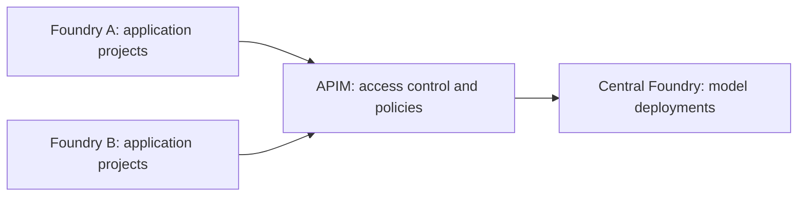

# Foundry Governance Lab

## Principles And Architecture

The platform owns approved models, application teams own their agents, and separation follows risk. Every service has an accountable owner. These [governance principles](docs/Governance.md) guide the lab.

One central **Foundry resource hosts the models**. Separate **Foundry resources contain each use case's projects and agents**. **API Management controls model access**, checking callers and applying policies before forwarding requests to the model backend.

[Architecture](docs/architecture.md) explains the resources, identities and boundaries behind this route.

## Tested Flows

Tests cover both **flows that must succeed** and **flows that must be blocked**: authorized gateway calls and own-project access, paired with anonymous calls, unauthorized callers and access to another project.

See [executed tests and results](docs/Tests.md) for what worked, what was denied and what remains unproven. These are historical results, not certification of a newly deployed lab. The [test plan](docs/test-plan.md) also includes scenarios not yet qualified.

## Deploy, Test, Tear Down

[scripts/Invoke-Lab.ps1](scripts/Invoke-Lab.ps1) exposes three independent operations:

| Operation | Action |
| --- | --- |
| Deploy | `-Action Create`: provision core infrastructure without running tests. |
| Test | `-Action Test`: run explicitly selected test groups. |
| Tear down | `-Action Teardown`: remove owned resources after separate approval. |

The [execution guide](docs/independent-lifecycle.md) provides complete commands and prerequisites, including the additional scope for Standard agent dependencies and hosted workloads. Resources remain billable until removed.
