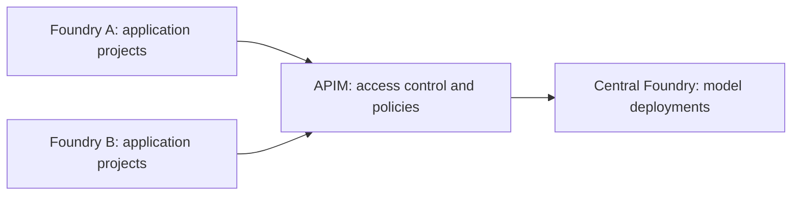

# Foundry Governance Lab

Application teams should be able to build agents autonomously while model access and shared resources remain governed.

## Governance Principles

- **Centrally managed models.** The platform team governs the catalog, deployments, access and capacity. Application teams choose approved models suited to their service.
- **Autonomy in development.** Teams build and manage agents without taking over administration of models or shared resources.
- **Separation according to risk.** Production and non-production have distinct boundaries. Sharing between use cases depends on data, permissions and the impact of failures; a project alone does not provide every isolation boundary.
- **Service accountability.** Each use case has an owner for quality, application security, consumption and continuity, even when Foundry manages execution.

Central management is a responsibility, not a requirement for a single physical model resource. Product limitations constrain today's implementation; they are not permanent principles. The [full governance model](docs/Governance.md) develops these principles into resource organization, access, data protection and service lifecycle requirements.

## How The Lab Applies Them

One central **Foundry resource hosts the models**. Separate **Foundry resources contain each use case's projects and agents**. **API Management controls model access**, checking callers and applying policies before forwarding requests to the model backend.

The lab adopts a gateway-only model route and a private-network baseline. These are implementation choices, not the only possible governance topology. [Architecture](docs/architecture.md) explains the resources, identities and boundaries behind them.

## Tested Flows

Tests cover both **flows that must succeed** and **flows that must be blocked**: authorized gateway calls and own-project access, paired with anonymous calls, unauthorized callers and access to another project.

See [executed tests and results](docs/Tests.md) for what worked, what was denied and what remains unproven. These are historical results, not certification of a newly deployed lab. The [test plan](docs/test-plan.md) also includes scenarios not yet qualified.

## Deploy, Test, Tear Down

[scripts/Invoke-Lab.ps1](scripts/Invoke-Lab.ps1) exposes three independent operations:

| Operation | Action |
| --- | --- |
| Deploy | `-Action Create`: provision core infrastructure without running tests. |
| Test | `-Action Test`: run explicitly selected test groups. |
| Tear down | `-Action Teardown`: remove owned resources after separate approval. |

The [execution guide](docs/independent-lifecycle.md) provides complete commands and prerequisites, including the additional scope for Standard agent dependencies and hosted workloads. Resources remain billable until removed.
