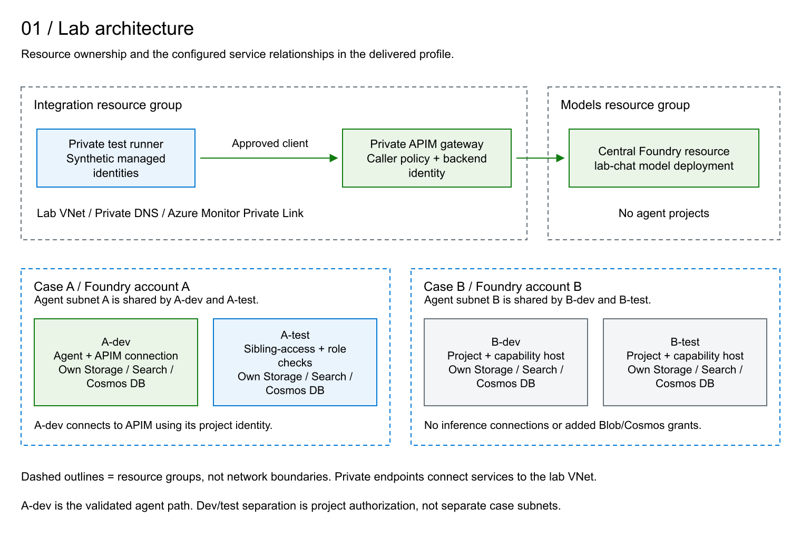
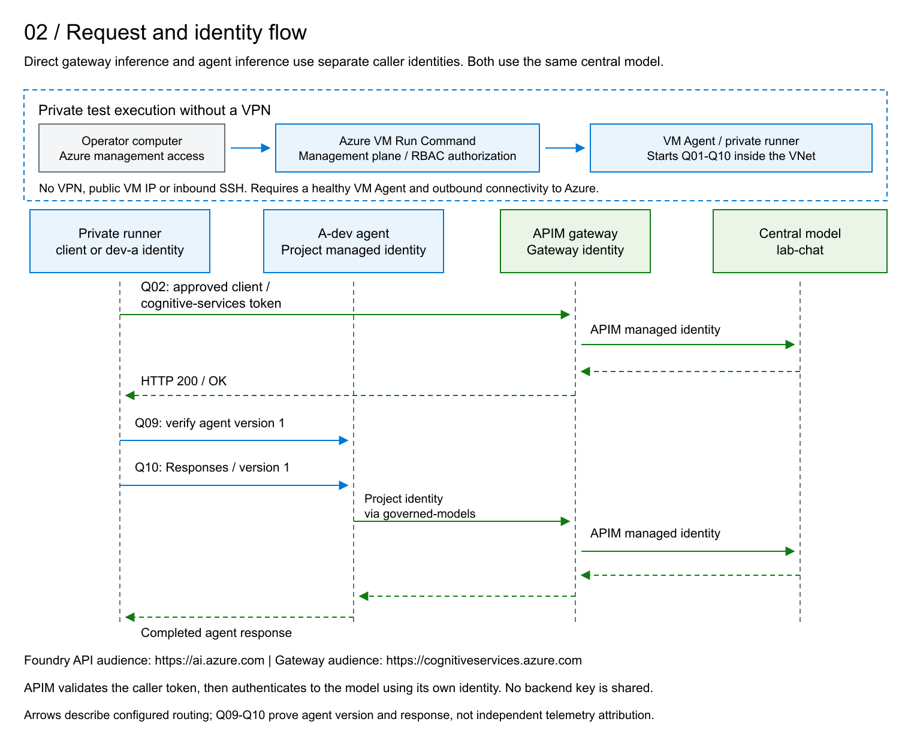

# Foundry Governance Lab: Components And Architecture

The lab separates model hosting, shared integration services and application projects. It demonstrates authenticated inference through a private gateway and selected project-level access controls. The model and agent run in managed Azure services; a private virtual machine executes the tests.

This document describes the delivered profile. Logical names such as A-dev and models identify component roles without exposing environment-specific identifiers. [Lab Lifecycle](Lifecycle.md) contains the creation and removal procedure; [Tests And Results](Tests.md) defines the eleven passing reference assertions and their scope.

## 1. Resource Groups And Responsibilities

| Resource group | Main components | Responsibility |
| --- | --- | --- |
| models | Central Foundry account, model deployment and private endpoint | Supply the shared model, without application agent projects. |
| integration | API Management, shared network and DNS, test VM, test identities and shared monitoring | Govern model access and provide private connectivity and test execution. |
| case-a | Foundry account A, dev/test projects, dedicated project dependencies and case monitoring | Host the validated A-dev agent and the A-test authorization and runtime-grant fixtures. |
| case-b | Foundry account B, dev/test projects, dedicated project dependencies and case monitoring | Provide a second use-case environment with separate identities and resources. Its inference path is not activated or validated. |

A resource group is an administrative boundary, not a network firewall. The groups share one virtual network owned by integration. Private endpoints belong to their service's resource group but attach to subnets in that shared network. Case A and case B are separate use cases, not the development and test halves of one application: each contains both environments.

## 2. Central Model Hosting

The models group contains a Foundry account of type AIServices and the lab-chat deployment of gpt-4.1-mini. Application projects and agent definitions do not reside in this account. The deployment uses Global Standard; the resource's region alone must not be interpreted as a guarantee that inference processing stays in that region.

Public data-plane access and local key authentication are disabled. The account private endpoint exposes the account subresource. Foundry uses several DNS domains, including cognitiveservices, openai and services.ai; their private DNS zones do not represent three different private endpoint types. Storage, Search and Cosmos DB have their own service-specific endpoints.

APIM's managed identity receives Cognitive Services OpenAI User on the central account. The lab does not grant direct central-model inference access to the project identities or the synthetic client. The central account's own identity is distinct from the identity APIM uses to call it. Account metrics are sent to the integration monitoring workspace.

The Foundry website and Azure management interfaces can remain reachable from the Internet. Seeing an account or deployment in the portal does not establish access to its private inference API. Playground inference from a workstation without the necessary private route and DNS is expected to be denied. Network settings also remain administratively changeable by sufficiently privileged operators; private access is not a substitute for restricting management permissions.

## 3. Integration Services

### 3.1 API Management

APIM is the shared inference gateway, not a model host or an agent runtime. It uses Standard v2 with one capacity unit, a system-assigned managed identity and a disabled developer portal. In its final configuration, public gateway access is disabled.

Two separate network features are configured: an inbound private endpoint lets private clients reach APIM, while outbound VNet integration in snet-apim lets APIM reach the central model's private endpoint. Outbound integration alone would not make the gateway private.

The lab-inference API exposes one HTTPS operation: POST /openai/deployments/lab-chat/chat/completions. It is not a general proxy to all model deployments.

| Control | Configuration and meaning |
| --- | --- |
| Authentication | Validate an Entra bearer token for the lab tenant and audience `https://cognitiveservices.azure.com`. Missing or invalid tokens are rejected. |
| Caller authorization | Accept only the object IDs of the A-dev project identity and the synthetic client identity. A valid token from another caller receives 403 CallerNotAllowed. |
| Subscription keys | No APIM subscription key is required. Entra authentication is still mandatory. |
| Request structure | Require application/json, a body of at most 16,384 bytes and 1-16 messages, each with a string role. This is structural validation, not prompt-content safety screening. |
| Generation parameters | Set max_tokens to 256 and n to 1; remove model and max_completion_tokens. Default stream to false when absent, without prohibiting an explicit streaming request. |
| Routing | Fix the backend to the central account and deployment lab-chat. Override the API version and remove unmatched query parameters. An unconfigured deployment route is rejected. |
| Backend credentials | Remove any api-key header and authenticate with APIM's own managed identity. The caller's identity is not forwarded as the model credential. |
| Usage controls | Configure 20 calls per minute and a 200-call quota per 24-hour period, using shared counters rather than a separate allowance for each caller. |

**Illustrative authorization, not the production pattern.** The lab validates Entra tokens but authorizes callers through an explicit object-ID allowlist in the APIM policy. Production deployments under [Governance](Governance.md#33-production-app-role-authorization), section 3.3, use Entra app roles: register the gateway API, assign its application permissions to the calling identities, and require the appropriate signed `roles` claim after token validation. Configure callers and Foundry connections to request tokens for that API instead of the lab's Cognitive Services audience. APIM's separate managed-identity authentication and Azure RBAC permission on the model backend remain necessary. The delivered templates and tests implement the illustrative allowlist, not this production app-role pattern.

The rate and quota thresholds are configuration values, not tested acceptance results or a monetary budget. Threshold enforcement has not been exercised in the quick suite. The quota-by-key documentation is inconsistent about v2 tier applicability; its configured presence must not be treated as verified quota enforcement. No semantic cache, multi-model routing, failover backend or additional APIM content-safety policy is configured.

### 3.2 Request And Identity Flow

The direct gateway test obtains a token as client and calls APIM. APIM validates that caller, applies its policy, obtains a separate token as the gateway identity and invokes lab-chat. The response returns through APIM to the client.

The agent path starts with dev-a calling the A-dev Foundry project API using a token for `https://ai.azure.com`. Foundry executes the existing agent. Its governed-models project connection calls APIM using the project managed identity and the cognitive-services audience. APIM then calls the same central model with its own identity and returns the result to the agent service, which completes the caller's response.

The gateway caller on this agent path is the A-dev project identity, not a human user or an individual agent identity. Adopting the production pattern with the same caller identity would assign the app role to that managed identity's service principal. No human sign-in is required for the model call. Agents using that shared identity would share its gateway permissions; per-agent authorization requires distinct identities supported by the connection and runtime.

These are separate authorization decisions: permission to invoke the project does not give dev-a direct access to APIM, and permission to call APIM does not grant client direct access to the central model. The reference tests validate direct gateway inference, the intended agent version and the completed agent response; they do not independently trace every internal hop.

### 3.3 Shared Network And DNS

One VNet contains eight subnets. No peering, VPN gateway or Bastion resource is deployed in this profile.

| Subnet | Role |
| --- | --- |
| snet-agent-a | Delegated agent network for both A-dev and A-test. |
| snet-agent-b | Separate delegated agent network for both B-dev and B-test. |
| snet-apim | Outbound VNet integration for API Management. |
| snet-runner | Private test VM and its network interface. |
| snet-models-pe | Private endpoint for the central Foundry account. |
| snet-case-a-pe | Private endpoints for case A and its data dependencies. |
| snet-case-b-pe | Private endpoints for case B and its data dependencies. |
| snet-integration-pe | Inbound APIM and Azure Monitor private endpoints. |

Network security groups are assigned to the two agent subnets, APIM, the runner and the endpoint subnets. Their configured rules deny cross-case agent traffic and direct agent access to the central-model subnet, while permitting the intended gateway and same-case dependency paths. Additional rules allow Cosmos DB direct-mode TCP traffic from each case's agent subnet only to the recorded private endpoint addresses. The runner has no permitted inbound connections, including SSH.

Private DNS zones and VNet links resolve service names to the corresponding private endpoint addresses. The zones cover Foundry, APIM, Blob Storage, Search, Cosmos DB and Azure Monitor. An ACR private DNS zone is also present for the broader template, but no container registry is deployed in this profile. A zone's presence does not prove that its associated service is deployed.

The NAT gateway and its public IP provide outbound connectivity for the runner and agent subnets. That public IP does not expose the VM or create public inbound access to the private services. NAT is not an application-layer firewall or an outbound destination allowlist.

### 3.4 Private Test Runner

The runner is an Ubuntu VM with PowerShell, a private NIC and a managed OS disk. It has no public IP and uses Trusted Launch, Secure Boot and vTPM. Seven user-assigned managed identities let the same scripts exercise different authorization contexts without storing application passwords or transferring the operator's Azure credentials.

On demand, the VM checks private DNS and connectivity, calls APIM and Foundry, and returns test results. Q01-Q10 run there; Q11 inspects Azure role configuration from the operator's computer through the management plane. Initial setup creates the test agent in Foundry; repeat quick tests use that existing agent without replacing it. The VM does not host the model or the agent runtime, and normal agent-to-gateway inference does not depend on the test VM.

*Operational note. Azure VM Run Command executes the test scripts through the VM Agent without a VPN, public VM IP or inbound SSH connection. It is remote script execution, not an interactive login. The VM must be running, its agent healthy and its required Azure outbound connectivity available. Run Command is an administrative permission: the scripts run with elevated privileges and can use the identities attached to the VM.*

### 3.5 Monitoring

Integration and each case have a Log Analytics workspace and an Application Insights resource. Central-model metrics use the integration workspace; the case accounts use their respective workspaces. The configured APIM and Foundry diagnostic settings export metrics, not prompt or response payloads. Deploying Application Insights does not by itself prove that an application has emitted traces or that every request hop is correlated.

An Azure Monitor Private Link Scope in integration links these monitoring resources, with private-only ingestion and query modes. Its private endpoint and DNS configuration provide the monitoring network path. Workspace retention and ingestion controls are defined in infrastructure. This monitoring configuration is not a claim that all service-managed data retention has been independently audited.

## 4. Case A And Case B

Each case contains one Foundry account with project management enabled and two projects. Accounts and projects have separate system-assigned identities. The accounts have private endpoints and agent network injection into their respective delegated subnets; model deployments remain centralized in models.

| Component per case | Purpose |
| --- | --- |
| Two projects: dev and test | Separate application definitions, connections and project authorization. |
| Two Storage accounts | One per project for files and agent-service data, with private Blob access. |
| Two Search services | One per project, connected as the vector-store dependency. Their presence does not establish a populated or tested RAG application. |
| Two Cosmos DB accounts | One per project, connected as the agent-service conversation-state dependency. |
| Project connections | Bind each project to its own Storage, Search and Cosmos resources using Entra authentication. |
| Capability hosts | Account- and project-level service configuration for Agents and their dependencies. They are not customer-managed VMs. |
| Private endpoints and NICs | Connect Foundry and data services to the appropriate case endpoint subnet. |
| Monitoring and role assignments | Provide case-level monitoring resources and scoped permissions for developers and service identities. |

The infrastructure disables public access and local-key authentication on the configured Foundry and data resources. Each project receives the provisioning and Search permissions defined by its dependency template. Additional scoped Blob and Cosmos data permissions support the validated A-dev runtime; the corresponding A-test grant configuration is also verified. B-dev and B-test do not receive those additional scoped Blob/Cosmos runtime grants in the delivered profile.

| Project | Delivered role and verification scope |
| --- | --- |
| A-dev | Working agent, governed-models connection to APIM and successful agent inference. |
| A-test | Sibling-project authorization fixture and verification of three scoped runtime grants. No validated agent inference path. |
| B-dev and B-test | Separate projects, dependencies and capability hosts, without added inference connections or a validated inference path. |

No container registries or customer-hosted agent containers are deployed. Completing model inference on B is not necessary to repeat the functional result established on A-dev. B supplies a second use case against which cross-case boundaries can be tested; merely provisioning it does not demonstrate those boundaries.

## 5. Managed Identities And Permissions

A managed identity is a nonhuman Entra identity through which a workload obtains tokens without managing its own password or key. Creating an identity does not grant access. Authorization comes from RBAC assignments, service-specific permissions or the gateway's explicit caller policy.

System-assigned identities belong to the lifecycle of their resource. APIM uses its identity for central-model inference; project identities authenticate to their configured connections and authorized dependencies. User-assigned identities are standalone Azure resources. The seven visible identities in integration are synthetic test actors attached to the runner, not seven separate application services.

| Test identity | Intended role in this profile |
| --- | --- |
| dev-a | Case A developer: account Reader and project access on A-dev. Used for own-project success, sibling-project denial and gateway-denial checks. |
| consumer-a | Separate consumer role assigned on A-dev. Not exercised by the quick acceptance suite. |
| dev-b | Case B developer: account Reader and project access on B-dev. Not exercised by the quick acceptance suite. |
| publisher-a and publisher-b | Reserved for container-publishing scenarios. No registry is deployed, so these actors have no active registry-publishing function here. |
| client | Explicitly allowlisted direct APIM caller, without the lab's direct central-model inference grant. |
| denied | Negative-test actor with no intended application authorization from the lab. Its name does not implement an explicit deny policy. |

All seven actors share one VM. An administrator, or code able to request their tokens on that VM, can use those attached identities. This is a controlled test arrangement, not production isolation between untrusted workloads. In production, each workload should receive only the identities and permissions it requires. Editing APIM policy is also an administrative privilege because policies can act through the gateway identity.

## 6. Separation And Evidence

Private reachability, token authentication and authorization are distinct controls. A private endpoint does not grant data access, and a valid token does not authorize every operation. The runner deliberately has network reachability to the resources it tests so that explicit authorization denials can be distinguished from network failures.

The quick suite confirms authorized gateway inference; rejection of anonymous, disallowed-caller, wrong-audience and wrong-route requests; A-dev access and A-test denial for dev-a; the existing agent definition and completed response; and the intended A-test grant configuration. Expected denials are successful assertions when their positive controls pass.

Within each case, dev and test share the agent subnet but have separate projects, identities and data dependencies. The A-dev/A-test agent-list test is evidence for that specific authorization boundary, not proof of every project permission or complete network isolation. Q11 checks configuration, not data reads or writes by A-test.

Cross-case A/B authorization and runtime network-denial tests are not included in the eleven-assertion acceptance profile. Dependency checks from the runner establish private DNS and connectivity, not isolation between the agent subnets. An A/B authorization test can compare permitted and denied access to the same project operation without activating a second inference path; a network-denial claim requires an appropriate source in the relevant agent network.

## 7. Configuration And Operation

APIM's service configuration, network integration, private endpoint, API, operation, JSON schema, policy and central-model RBAC assignment are declared in Bicep. The policy XML is loaded by the template. The customer procedure does not require completing APIM configuration manually in the portal.

| Phase | Effect |
| --- | --- |
| bootstrap | Create shared resources and the initial profile, including APIM and private endpoints. Public gateway access remains enabled during this stage. |
| lock | Disable public access, then verify private connectivity before activating the API. |
| activate | Deploy the API and policy, grant APIM model access and configure the A-dev model connection. |

PowerShell scripts compile and validate templates, prepare parameters, run what-if, submit deployments and verify results. Before activation they read the existing APIM identity and pass its principal ID to Bicep; Bicep still creates the role assignment. The policy Attest action reads and verifies the final configuration without redeploying it. The delivered activation template already contains the final policy.

The remaining lifecycle stages provision the project dependencies, capability hosts and selected runtime grants. Repeat quick tests exercise the retained environment. Teardown is a separate, explicitly approved operation; it is not part of a test run. The reference lab remains available for observation and continues to incur resource charges while retained.

Production availability, disaster recovery, load capacity, content safety, complete effective-permission analysis and request-level telemetry require separate qualification. The reference results are functional evidence for the defined assertions, not a certification of every production control.

## References

- [Customer lifecycle](Lifecycle.md) and [acceptance assertions](Tests.md).
- [Diagram files and editable sources](../diagrams/README.md).
- [Foundry private networking](https://learn.microsoft.com/azure/foundry/agents/how-to/virtual-networks) and [managed identities](https://learn.microsoft.com/entra/identity/managed-identities-azure-resources/overview).
- [APIM outbound VNet integration](https://learn.microsoft.com/azure/api-management/integrate-vnet-outbound) and [quota policy reference](https://learn.microsoft.com/azure/api-management/quota-by-key-policy).
- [Azure VM Run Command](https://learn.microsoft.com/azure/virtual-machines/linux/run-command).
