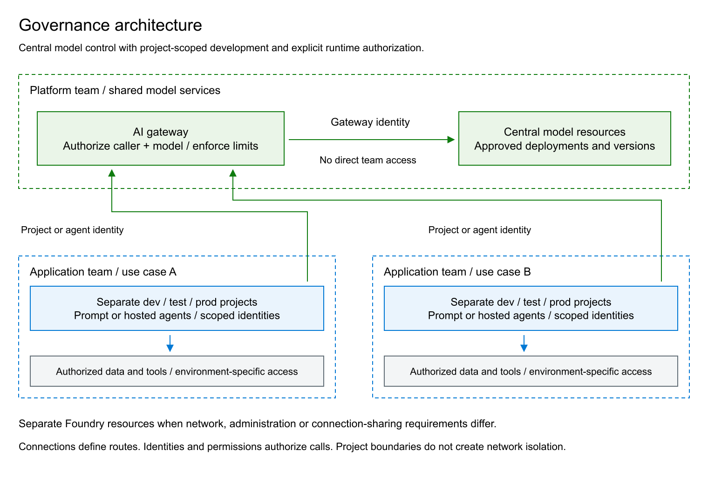
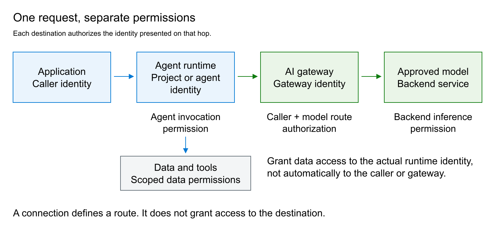

# Microsoft Foundry: Governance Standard

## 1. Principles

- **Central model management.** The platform team approves models, manages their deployments and capacity, and controls access through a shared AI gateway.
- **Application-team autonomy.** Teams build and operate agents within assigned projects. This does not require administration of the central models or shared infrastructure.
- **Explicit separation.** Projects, identities, data permissions and network boundaries serve different purposes. Sharing one does not justify sharing the others.
- **Service ownership.** Each use case has an owner accountable for application quality, authorized data use, consumption and operational readiness, including when Foundry manages the runtime.

This standard applies to the current Foundry Agent Service, including prompt agents and hosted agents. It defines an organizational architecture, not a product requirement or a deployment procedure. Requirements expressed as "must" are acceptance conditions for adopting this standard.

## 2. Architecture And Boundaries

### 2.1 Resource Responsibilities

| Component | Responsibility and boundary |
| --- | --- |
| Central model resources | Host approved model deployments, without application-agent projects. The platform team controls model versions, deployment types, access and capacity. |
| AI gateway | Authenticate and authorize callers, restrict model routes, enforce usage policies and attribute consumption. Azure API Management is one implementation. The gateway does not host agents or models. |
| Use-case Foundry resource | Contain projects for a use case or an approved group of compatible use cases. It hosts no local model deployments under this standard. |
| Foundry project | Organize agents, connections and project-level access for one application environment. It is not an independent network perimeter. |
| Data and runtime dependencies | Supply storage, retrieval, tools, container images and telemetry. Each has its own access controls, network configuration and lifecycle. |

Central management does not require one physical model resource for the entire organization. Start with a shared resource where requirements permit; separate resources when residency, capacity or availability requirements demand it. The same central approval and gateway controls apply to all of them.

Applications invoke the agent endpoint for their use case. The agent reaches approved models through the gateway, which authenticates to the model backend with its own authorized identity. Direct model consumption, where required by an application, must also use an explicitly authorized gateway route.

### 2.2 Choosing The Isolation Boundary

Use separate projects for development, test and production. Use separate Foundry resources when environments or use cases need independent network settings, resource administration or shared-connection exposure. Incompatible data or production access requirements must not be resolved by granting broader permissions on a shared resource.

Azure RBAC permissions are additive and inherited. A project-scoped role does not remove access already granted at resource, resource-group or subscription scope. Review inherited assignments before treating a project as an authorization boundary. A resource group organizes ownership and lifecycle; it does not filter network traffic.

Create model connections through a controlled provisioning identity. Record the connection's actual scope, authentication method, caller identity and exposed models. Resource-scoped connected-model configurations can be available to every project in that resource; do not use their visibility as evidence of project-specific authorization. Enforce the permitted caller/model combinations at the gateway.

## 3. Model Access And Gateway Controls

### 3.1 Approved Model Contract

For each approved model route, maintain the deployment and model version, supported protocol and tools, processing geography, capacity allocation, usage limits and retirement plan. The Azure resource region alone does not establish where inference is processed: assess the selected deployment type, including Global and Data Zone options.

A connection makes a remote model discoverable to an agent; it neither copies the deployment nor grants access to it. Connected-model support varies by tool and protocol. Verify the required combination before selecting the architecture, rather than assuming every native Foundry feature works through any gateway.

Expose approved routes only. Application teams must not receive direct central-model inference permissions or credentials. Restrict network paths and access administration so that changing a client endpoint cannot bypass the gateway. Developers must not be able to deploy local replacement models as an alternative route around these controls.

### 3.2 Gateway Policy

- Validate token issuer, tenant and audience, then authorize the caller for the requested model and environment. Successful authentication alone is insufficient.
- Fix the permitted backend, deployment and operations. Do not accept arbitrary destinations or credentials supplied by callers.
- Authenticate separately to the backend using a managed identity where supported. Keep backend keys out of application code; any necessary secret must have an owner, protected storage and rotation.
- Set request-size and generation limits appropriate to the service. Define rate and token limits per use case, with shared-capacity protection where needed. Restrict who can edit policies because policies can act through the gateway identity.
- Measure usage, failures and latency with a stable use-case identifier derived from authenticated context. Do not trust an arbitrary client header for authorization or billing attribution.

A rate limit, a token quota and a monetary budget are different controls. Validate enforcement on the selected gateway tier and policy; configure cost alerts and escalation separately. Retries must be bounded and respect throttling responses. Failover must preserve model compatibility, authorization and processing-location requirements, not silently select an unapproved backend.

### 3.3 Production App-Role Authorization

Production deployments under this standard must authorize application callers through Microsoft Entra app roles, rather than a list of caller object IDs embedded in the gateway policy. Register the gateway API in Entra and expose application permissions such as `Inference.Invoke`. Assign the required app roles to the managed identities or other service principals that actually call the gateway. Define separate permissions where model routes or environments require different access.

These are service-to-service application permissions, not roles that require a human sign-in. Define the app role with `Application` as an allowed member type and assign it directly to the calling managed identity's service principal. The agent runtime obtains an app-only token; no signed-in user or delegated user token is required. Azure manages the managed identity's credentials. The API registration represents the protected gateway and does not replace the caller's managed identity.

Callers request an access token for the registered gateway API. APIM validates its signature, issuer, tenant, lifetime and audience, then requires the appropriate value in the signed `roles` claim for the requested operation. A missing or insufficient role must deny access. Role assignments are managed in Entra; changing an authorized caller does not require editing the policy's list of identities. The Foundry connection must request the gateway API's token audience; a token intended for Cognitive Services does not establish these custom application permissions.

App roles are not Azure RBAC roles. APIM still uses its own managed identity, a separate Cognitive Services token and the required backend data-plane role to invoke the central model. Before production acceptance, verify a permitted end-to-end request and denials for missing or incorrect app roles and wrong audiences. Validate this pattern on the selected connection and runtime; an identity-allowlist demonstration does not establish app-role enforcement.

## 4. Identities And Permissions

### 4.1 People And Deployment Automation

Authenticate people and applications through Microsoft Entra ID; prefer managed identities for workloads. Assign human access through security groups by responsibility and environment, with time-limited privileged access where available. Separate infrastructure provisioning and role assignment from everyday development; prefer federated pipeline credentials to long-lived deployment secrets.

| Responsibility | Baseline role and scope |
| --- | --- |
| Central model administration | Foundry Account Owner on the central model resource; inference and role-assignment permissions are reviewed separately. |
| Infrastructure provisioning | Contributor on the dedicated resource group, or a narrower role covering the required resources. This is not an application runtime identity. |
| Access administration | Role Based Access Control Administrator at the smallest required scope, with assignment conditions where supported. |
| Agent development | Foundry User on the assigned project; Reader on the parent resource when needed for discovery and portal navigation. |
| Agent endpoint consumption | Foundry Agent Consumer on the specific agent, or on the project only when all its agents are in scope. |
| Gateway-to-model inference | A model-provider data-plane role on the approved backend; for Azure OpenAI inference, Cognitive Services OpenAI User is the usual baseline. |

Confirm required operations against the current role definitions. Foundry roles may appear under their former Azure AI names while naming changes roll out; role IDs and permissions determine access. Generic Owner or Contributor access must not be assumed to grant every Foundry data-plane operation.

Foundry Agent Consumer covers agent endpoint interaction, not every resource called an application. A Foundry agent application uses a separate invocation permission and scope. Identify the endpoint contract before assigning access; do not grant development rights merely to make a consumer call succeed.

### 4.2 Runtime Identity

Distinguish the application caller, project managed identity, hosted-agent identity and gateway identity. For each connection, establish which identity actually obtains the token and assign permissions to that identity on the destination. Creating a connection or attaching an identity does not authorize it.

The project identity supports platform operations and configured connections. A hosted agent has a separate Entra identity for runtime access. Grant data and tool permissions by required operation and environment, not by copying all permissions from the project to the agent. A shared identity shares its effective authorization across the workloads that can use it.

An app role assigned to a shared project identity does not distinguish individual agents using that identity. Per-agent gateway authorization requires distinct caller identities and a connection and runtime that support obtaining tokens as those identities.

Applications must authorize their own users and enforce conversation and document ownership. A backend service identity does not distinguish those users by itself. Where delegated user identity is supported, validate the delegation contract; otherwise enforce access in the application and data layer. Never accept a conversation identifier as proof of ownership.

## 5. Private Networking And Data Protection

### 5.1 Network Controls

Private data-plane access is the baseline for Foundry, model backends and sensitive dependencies. Disable public access and local-key authentication where supported, unless a documented exception is approved. Validate DNS and routing from every actual caller, including agent runtimes, build systems and operational tools.

Inbound private endpoints and runtime outbound connectivity solve different problems. A Foundry private endpoint does not automatically place the agent runtime in the required network. Likewise, APIM outbound VNet integration does not make its gateway private: inbound access must be configured separately on a supporting tier. NAT provides outbound translation, not an egress allowlist.

The public Foundry portal and Azure management APIs are separate from private service APIs. Viewing a resource in the portal does not prove that its playground or inference endpoint is reachable. Management permissions still allow authorized administrators to change network settings and must be controlled accordingly.

Allow runtime egress only to approved models, tools and dependencies through supported network controls. Test the effective network path; a private DNS record or provisioned endpoint alone is not evidence of isolation. Any public channel or endpoint exception must identify the exposed protocol, authentication controls and data permitted on that route.

### 5.2 Data And Tool Authorization

Data owners approve sources, retrieval scope, permitted actions and retention. Apply permissions at the smallest supported data scope. Retrieval must enforce the requesting user's or application's authorization before returning content; prompt instructions and a shared search index are not access controls.

Treat model output and retrieved instructions as untrusted input to tools. Validate tool arguments, constrain destinations and operations, and require approval for consequential actions where the service risk warrants it. Content-safety filters and prompt-injection defenses complement these controls; neither replaces authorization.

Classify prompts, responses, files, conversation state and telemetry. Define access, retention and deletion for every store, including service-managed state. Do not log payloads by default. When payload capture is necessary, minimize or redact content and restrict access; diagnostic settings do not establish the retention behavior of every underlying service.

## 6. Agent Implementation And Release

### 6.1 Prompt Or Hosted Agent

Use a prompt agent when instructions, approved models and supported tools meet the requirements. Use a hosted agent when custom orchestration, libraries or executable logic are necessary. Managed hosting reduces infrastructure work but does not transfer responsibility for dependencies, application vulnerabilities or unsafe tool behavior to the platform.

Hosted agents require an approved container delivery path and telemetry resources. Under the private baseline, use a private Azure Container Registry and build/push infrastructure with the required private connectivity. Confirm that the Foundry project supports private-registry pulls; older projects may have different network constraints. With RBAC Registry + ABAC Repository Permissions, grant Container Registry Repository Writer to the publisher and Container Registry Repository Reader to the project identity used for image pulls; constrain repositories with conditions where appropriate. Runtime tool permissions belong to the actual runtime identity, not to the publisher.

Connect Application Insights to Log Analytics and grant operators only the required telemetry access. If evaluations read workspace data, grant the documented workspace data-read permission to the evaluation identity. Verify region, networking and feature availability for the chosen runtime before approval.

### 6.2 Controlled Promotion

Version infrastructure, gateway policies, agent definitions and connection configuration. Promote a tested agent version and immutable image artifact; inject environment-specific bindings without moving development credentials or data into production. Separate building an image, publishing it, deploying it and assigning its permissions.

Model, prompt, tool and dependency changes can alter behavior independently. Run representative quality, safety and authorization tests before promotion. Retain a rollback route and a tested way to disable the agent or a tool. Do not depend on an unspecified "latest" version for production reproducibility. The platform team must notify affected owners of model changes and retirements early enough to qualify a replacement.

## 7. Operational Acceptance

The platform team owns shared models, gateway policy, shared connectivity and capacity. The application owner owns agent behavior, user authorization, data use and service outcomes. Data owners authorize source access and tool actions. Operational ownership includes alert response, incident escalation and removal of obsolete access.

Before production use, retain evidence that:

- The named owner, environment placement, data classification, model route and approved identities match the deployed configuration, including inherited permissions.
- An authorized end-to-end request succeeds through the intended route. Anonymous, wrong-audience, unauthorized-model and direct-backend requests are rejected as designed.
- A representative identity can access its own project and data but cannot access another use case or environment. Each denial has a successful permitted control; a network failure is not proof of an authorization boundary.
- Private DNS, runtime egress, image pulls and required tool paths work from their real sources. Network-denial claims are tested from those sources, not only from an administrator's workstation.
- Usage controls and alerts have been exercised. Operators can correlate failures without unnecessary payload exposure, and the service has defined capacity and availability objectives.
- The deployed version is recorded; rollback, recovery, credential revocation and data-retention procedures have been tested to the extent required by the service risk.

Test results establish the specific controls exercised, not universal isolation or production certification. Recheck affected controls after changes to identities, network rules, connections, models or gateway policy. Exceptions require an owner, rationale, compensating controls and review or expiry condition; they must not remain undocumented implementation choices.

## References

- [Foundry resource and project planning](https://learn.microsoft.com/azure/foundry/concepts/planning) and [Foundry roles and scopes](https://learn.microsoft.com/azure/foundry/concepts/rbac-foundry).
- [Connected Foundry models](https://learn.microsoft.com/azure/foundry/agents/how-to/connected-models) and [AI gateway connections](https://learn.microsoft.com/azure/foundry/agents/how-to/ai-gateway).
- [OAuth authorization for AI APIs](https://learn.microsoft.com/azure/api-management/api-management-authenticate-authorize-ai-apis#oauth-20-authorization-by-using-identity-provider), [APIM token and claim validation](https://learn.microsoft.com/azure/api-management/validate-azure-ad-token-policy) and [app-role assignments to managed identities](https://learn.microsoft.com/entra/identity/managed-identities-azure-resources/assign-app-role-managed-identity-powershell).
- [Hosted agents](https://learn.microsoft.com/azure/foundry/agents/concepts/hosted-agents) and [hosted-agent permissions](https://learn.microsoft.com/azure/foundry/agents/concepts/hosted-agent-permissions).
- [Agent Service private networking](https://learn.microsoft.com/azure/foundry/agents/how-to/virtual-networks) and [ACR repository permissions](https://learn.microsoft.com/azure/container-registry/container-registry-rbac-abac-repository-permissions).
