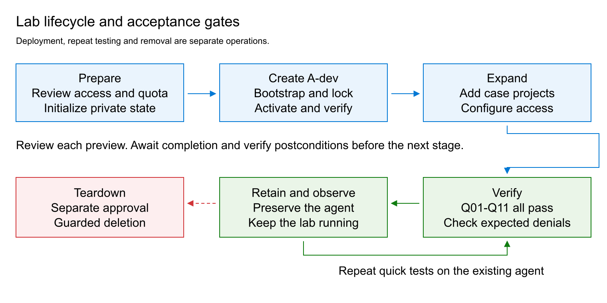

# Customer Lab Lifecycle

Create a new environment with the four-group profile below, retain it for repeat quick tests, and remove it through the customer teardown workflow. This is a fresh run with a new lab identifier and private run directory, not a replay of an existing environment. The retained groups are models, integration, case-a and case-b. Only A-test receives the additional runtime grants in this profile.

Compilation and local checks validate the delivered procedure; a new environment must complete its own deployment and acceptance checks.



## Architecture

| Component | Purpose |
| --- | --- |
| Models group | Central Foundry resource and pinned model deployment; no agent projects. |
| Integration group | Private APIM gateway, virtual network, private DNS, monitoring links and private test runner. |
| Case A | A-dev and A-test projects with separate Storage, Search and Cosmos DB dependencies. A-dev is the working inference project; A-test is the sibling-authorization and runtime-role fixture. |
| Case B | Separate Foundry resource, agent subnet, dev/test projects, private dependencies and capability hosts. This profile does not add inference connections or runtime data grants to these two projects. |

The profile has no container registries or hosted workloads. Dev/test projects share their case's agent subnet. Only APIM receives the central model inference grant; the gateway authenticates callers separately and uses its own managed identity for the backend.


## Private Runner Access Without A VPN

The operator runs scripts inside the private VM without any VPN, a public IP on the VM, or inbound SSH access. Azure VM Run Command sends the execution request through the Azure management plane to the VM Agent. The scripts then call APIM and Foundry from inside the lab VNet, using the runner's managed identities. The operator's computer does not need a route to the private service endpoints.

The VM must be running, its agent healthy, and the required outbound connectivity to Azure available. Run Command requires Azure RBAC authorization and executes with elevated operating-system privileges in this lab; its use must be restricted to authorized administrators. It does not bypass the network or authorization controls on APIM and Foundry. See [Azure VM Run Command](https://learn.microsoft.com/azure/virtual-machines/linux/run-command).

## Preparation

Use PowerShell 7, Azure CLI with its bundled Python on Windows, Bicep and OpenSSH. Start in the package root. Use an already authenticated, dedicated Azure CLI configuration with the reviewed subscription and tenant. Confirm required deployment and role-assignment permissions, regional capacity and organizational policy compatibility before starting. Keep state, credentials and evidence outside the package, under a restricted private directory. Keep the package unchanged during a run because reviews bind source hashes.

Register the required providers through the subscription's approved process before deployment: Microsoft.CognitiveServices, Microsoft.Storage, Microsoft.Search, Microsoft.DocumentDB, Microsoft.Network, Microsoft.App, Microsoft.ContainerService, Microsoft.MachineLearningServices, Microsoft.KeyVault, Microsoft.Compute, Microsoft.ManagedIdentity, Microsoft.ApiManagement, Microsoft.Insights and Microsoft.OperationalInsights. Confirm the model and VM quota for Sweden Central. Review the generated private parameters before bootstrap; do not change ownership fields or generated key bindings.

The templates reference pinned Azure Verified Modules. On a new machine, restore them from the public registry before running the offline check. Restore downloads modules; it does not provision resources. A disconnected machine needs the same module cache populated through an approved process.

```powershell
$compiler = (Get-Command bicep -CommandType Application).Source
foreach ($template in 'main','standard','expansion-foundation','expansion-standard') {
    & $compiler restore "./infra/$template.bicep"
    if ($LASTEXITCODE -ne 0) { throw 'Module restore failed' }
}
./tests/Test-CustomerPackage.ps1 -BicepExecutable $compiler
```

Execute each command separately and review its result before continuing. A successful process exit is not deployment completion. After each deployment submission, use only its matching `Status` command until the receipt confirms successful completion and verified postconditions; do not replay `Preview` or `Deploy` while pending. Account-host reuse completes during `Deploy` and has no subsequent `Status` step. Stop on unexpected resources, ownership mismatches, blocked checks or failed deployments. Leave inherited external Azure Policy assignments unchanged; incompatible effects require review, not policy removal or relaxed validators.

Initialization requires explicit consent to both deployment and eventual destruction. The approval switches below record that consent; they are not a substitute for it. Set the existing CLI configuration path when prompted. The generated lab identifier and run directory must be unused.

```powershell
$ErrorActionPreference = 'Stop'
$compiler = (Get-Command bicep -CommandType Application).Source
$azureConfig = Read-Host 'Absolute path to the reviewed, authenticated Azure CLI configuration'
$labId = 'cust' + [guid]::NewGuid().ToString('N').Substring(0, 8)
$runDirectory = Join-Path $env:LOCALAPPDATA "CustomerLab/$labId"
$state = Join-Path $runDirectory 'state.json'
./scripts/Initialize-LabRun.ps1 -RunDirectory $runDirectory -AzureConfigDirectory $azureConfig -LabId $labId -BicepExecutable $compiler -MinimalPrompt -ApproveDeployment -ApproveDestroy
```

## Create Minimal And Standard

Review each Preview before authorizing its Deploy. Observe pending deployments with Status, then move to the next command only after completion. Prepare the runner before locking access, and verify private access before activation.

```powershell
./scripts/Invoke-LabStage.ps1 -StatePath $state -Phase bootstrap -Action Preview
./scripts/Invoke-LabStage.ps1 -StatePath $state -Phase bootstrap -Action Deploy
./scripts/Invoke-LabStage.ps1 -StatePath $state -Phase bootstrap -Action Status
./scripts/Invoke-LabRunner.ps1 -StatePath $state -Action Prepare
./scripts/Invoke-LabStage.ps1 -StatePath $state -Phase lock -Action Preview
./scripts/Invoke-LabStage.ps1 -StatePath $state -Phase lock -Action Deploy
./scripts/Invoke-LabStage.ps1 -StatePath $state -Phase lock -Action Status
./scripts/Invoke-LabRunner.ps1 -StatePath $state -Action VerifyPrivate
./scripts/Invoke-LabStage.ps1 -StatePath $state -Phase activate -Action Preview
./scripts/Invoke-LabStage.ps1 -StatePath $state -Phase activate -Action Deploy
./scripts/Invoke-LabStage.ps1 -StatePath $state -Phase activate -Action Status
./scripts/Invoke-StandardStage.ps1 -StatePath $state -Stage dependencies -Action Preview
./scripts/Invoke-StandardStage.ps1 -StatePath $state -Stage dependencies -Action Deploy
./scripts/Invoke-StandardStage.ps1 -StatePath $state -Stage dependencies -Action Status
./scripts/Test-StandardPrivate.ps1 -StatePath $state
./scripts/Invoke-StandardStage.ps1 -StatePath $state -Stage account -Action Preview
./scripts/Invoke-StandardStage.ps1 -StatePath $state -Stage account -Action Deploy
./scripts/Invoke-StandardStage.ps1 -StatePath $state -Stage project -Action Preview
./scripts/Invoke-StandardStage.ps1 -StatePath $state -Stage project -Action Deploy
./scripts/Invoke-StandardStage.ps1 -StatePath $state -Stage project -Action Status
./scripts/Invoke-StandardStage.ps1 -StatePath $state -Stage access -Action Preview
./scripts/Invoke-StandardStage.ps1 -StatePath $state -Stage access -Action Deploy
./scripts/Invoke-StandardStage.ps1 -StatePath $state -Stage access -Action Status
./scripts/Invoke-StandardCosmosNetwork.ps1 -StatePath $state -Action Preview
./scripts/Invoke-StandardCosmosNetwork.ps1 -StatePath $state -Action Deploy
./scripts/Invoke-StandardCosmosNetwork.ps1 -StatePath $state -Action Status
./scripts/Update-LabGatewayPolicy.ps1 -StatePath $state -Action Attest
./scripts/Test-StandardPrivate.ps1 -StatePath $state
./scripts/Invoke-LabRunner.ps1 -StatePath $state -Action MinimalPrompt -ExpectedAgentVersion '1'
./scripts/Export-MinimalPromptEvidence.ps1 -StatePath $state -SummaryPath (Join-Path $runDirectory 'runner-MinimalPrompt.json')
```

Require account-host reuse, the expected A-dev agent at version `1`, successful inference and a completed evidence export before expansion. Stop if any of these conditions is absent. The initial MinimalPrompt command establishes the agent; use the quick command for repeat testing. Gateway `Attest` verifies the existing final policy and its ownership, identity, private-network and activation bindings without redeployment.

## Expand The Retained Profile

Foundation creates case-b and the additional project resources. Deploy all three dependency sets and pass their private probes before making the three network changes. Every Preview and Deploy below requires its explicit approval switch. Gateway attestation verifies the already-activated final policy without submitting another policy deployment.

```powershell
./scripts/Invoke-ExpansionFoundation.ps1 -StatePath $state -Action Preview -BicepExecutable $compiler -ApproveFoundationCreation
./scripts/Invoke-ExpansionFoundation.ps1 -StatePath $state -Action Deploy -BicepExecutable $compiler -ApproveFoundationCreation
./scripts/Invoke-ExpansionFoundation.ps1 -StatePath $state -Action Status -BicepExecutable $compiler
./scripts/Invoke-ExpansionStandard.ps1 -StatePath $state -Project a-test -Action Preview -BicepExecutable $compiler -ApproveDependencies
./scripts/Invoke-ExpansionStandard.ps1 -StatePath $state -Project a-test -Action Deploy -BicepExecutable $compiler -ApproveDependencies
./scripts/Invoke-ExpansionStandard.ps1 -StatePath $state -Project a-test -Action Status -BicepExecutable $compiler
./scripts/Test-ExpansionPrivate.ps1 -StatePath $state -Project a-test -BicepExecutable $compiler
./scripts/Invoke-ExpansionStandard.ps1 -StatePath $state -Project b-dev -Action Preview -BicepExecutable $compiler -ApproveDependencies
./scripts/Invoke-ExpansionStandard.ps1 -StatePath $state -Project b-dev -Action Deploy -BicepExecutable $compiler -ApproveDependencies
./scripts/Invoke-ExpansionStandard.ps1 -StatePath $state -Project b-dev -Action Status -BicepExecutable $compiler
./scripts/Test-ExpansionPrivate.ps1 -StatePath $state -Project b-dev -BicepExecutable $compiler
./scripts/Invoke-ExpansionStandard.ps1 -StatePath $state -Project b-test -Action Preview -BicepExecutable $compiler -ApproveDependencies
./scripts/Invoke-ExpansionStandard.ps1 -StatePath $state -Project b-test -Action Deploy -BicepExecutable $compiler -ApproveDependencies
./scripts/Invoke-ExpansionStandard.ps1 -StatePath $state -Project b-test -Action Status -BicepExecutable $compiler
./scripts/Test-ExpansionPrivate.ps1 -StatePath $state -Project b-test -BicepExecutable $compiler
./scripts/Invoke-ExpansionCosmosNetwork.ps1 -StatePath $state -Project a-test -Action Preview -BicepExecutable $compiler -ApproveNetwork
./scripts/Invoke-ExpansionCosmosNetwork.ps1 -StatePath $state -Project a-test -Action Deploy -BicepExecutable $compiler -ApproveNetwork
./scripts/Invoke-ExpansionCosmosNetwork.ps1 -StatePath $state -Project a-test -Action Status -BicepExecutable $compiler
./scripts/Invoke-ExpansionCosmosNetwork.ps1 -StatePath $state -Project b-dev -Action Preview -BicepExecutable $compiler -ApproveNetwork
./scripts/Invoke-ExpansionCosmosNetwork.ps1 -StatePath $state -Project b-dev -Action Deploy -BicepExecutable $compiler -ApproveNetwork
./scripts/Invoke-ExpansionCosmosNetwork.ps1 -StatePath $state -Project b-dev -Action Status -BicepExecutable $compiler
./scripts/Invoke-ExpansionCosmosNetwork.ps1 -StatePath $state -Project b-test -Action Preview -BicepExecutable $compiler -ApproveNetwork
./scripts/Invoke-ExpansionCosmosNetwork.ps1 -StatePath $state -Project b-test -Action Deploy -BicepExecutable $compiler -ApproveNetwork
./scripts/Invoke-ExpansionCosmosNetwork.ps1 -StatePath $state -Project b-test -Action Status -BicepExecutable $compiler
```

Reuse the two account hosts, then create the three project hosts. Account selectors are a-test for case-a and b-dev for case-b; b-test shares the case-b account receipt. Confirm both account previews select Reuse and both Deploy commands complete that verification without a deployment submission. Do not issue account Status.

```powershell
./scripts/Invoke-ExpansionHosts.ps1 -StatePath $state -Project a-test -Stage account -Action Preview -Compiler $compiler -ApproveHosts
./scripts/Invoke-ExpansionHosts.ps1 -StatePath $state -Project a-test -Stage account -Action Deploy -Compiler $compiler -ApproveHosts
./scripts/Invoke-ExpansionHosts.ps1 -StatePath $state -Project b-dev -Stage account -Action Preview -Compiler $compiler -ApproveHosts
./scripts/Invoke-ExpansionHosts.ps1 -StatePath $state -Project b-dev -Stage account -Action Deploy -Compiler $compiler -ApproveHosts
./scripts/Invoke-ExpansionHosts.ps1 -StatePath $state -Project a-test -Stage project -Action Preview -Compiler $compiler -ApproveHosts
./scripts/Invoke-ExpansionHosts.ps1 -StatePath $state -Project a-test -Stage project -Action Deploy -Compiler $compiler -ApproveHosts
./scripts/Invoke-ExpansionHosts.ps1 -StatePath $state -Project a-test -Stage project -Action Status -Compiler $compiler
./scripts/Invoke-ExpansionHosts.ps1 -StatePath $state -Project b-dev -Stage project -Action Preview -Compiler $compiler -ApproveHosts
./scripts/Invoke-ExpansionHosts.ps1 -StatePath $state -Project b-dev -Stage project -Action Deploy -Compiler $compiler -ApproveHosts
./scripts/Invoke-ExpansionHosts.ps1 -StatePath $state -Project b-dev -Stage project -Action Status -Compiler $compiler
./scripts/Invoke-ExpansionHosts.ps1 -StatePath $state -Project b-test -Stage project -Action Preview -Compiler $compiler -ApproveHosts
./scripts/Invoke-ExpansionHosts.ps1 -StatePath $state -Project b-test -Stage project -Action Deploy -Compiler $compiler -ApproveHosts
./scripts/Invoke-ExpansionHosts.ps1 -StatePath $state -Project b-test -Stage project -Action Status -Compiler $compiler
./scripts/Invoke-ExpansionRuntimeAccess.ps1 -StatePath $state -Project a-test -Action Preview -Compiler $compiler -ApproveRuntimeAccess
./scripts/Invoke-ExpansionRuntimeAccess.ps1 -StatePath $state -Project a-test -Action Deploy -Compiler $compiler -ApproveRuntimeAccess
./scripts/Invoke-QuickLab.ps1 -StatePath $state -RunLive
```

The final pair is runtime Deploy followed by quick verification. Q11 is this profile's completion criterion for runtime grants: it reads the recorded deployment and verifies Succeeded plus the exact three grants, including principal, definition and scope. If provisioning is still active, retain the submission and observe through a later quick invocation without redeploying. The quick report is the acceptance record for these assertions, separate from extended coordinator records.

## Repeat Quick Tests

Run the following command against the retained environment. It exercises the existing agent without creation, replacement or deletion. Require exactly the eleven Q01-Q11 assertions in [Tests And Results](Tests.md) to be PASS; missing or nonpassing results fail acceptance.

```powershell
./scripts/Invoke-QuickLab.ps1 -StatePath $state -RunLive
```

## Teardown

Teardown is destructive and requires separate explicit approval. It is not part of repeat testing. Use [Remove-CustomerLab.ps1](../scripts/Remove-CustomerLab.ps1), which supports the core and the foundation-bound fourth group without changing the original run state. Keep its cleanup manifest outside both the package and the original run directory.

```powershell
$cleanup = Join-Path $env:LOCALAPPDATA "CustomerLabCleanup/$labId/cleanup.json"
./scripts/Remove-CustomerLab.ps1 -StatePath $state -CleanupPath $cleanup -Action Plan
./scripts/Remove-CustomerLab.ps1 -StatePath $state -CleanupPath $cleanup -Action Status
```

Review the exact groups and next target. Authorize one deletion with the matching lab identifier. Each Step rechecks the context, ownership, captured inventory and dependencies; it submits at most one destructive operation.

```powershell
./scripts/Remove-CustomerLab.ps1 -StatePath $state -CleanupPath $cleanup -Action Step -ConfirmLabId $labId -ApproveDestroy
./scripts/Remove-CustomerLab.ps1 -StatePath $state -CleanupPath $cleanup -Action Status
```

When Status reports Ready, review the next target and issue another approved Step. Pending means observe again; do not resubmit. Continue until Complete. The order removes owned monitoring links before their targets, project capability hosts before projects, then Foundry accounts and their groups, with integration last. Both agent subnets must be free of service-association links before virtual-network removal. Unknown resources, external targets, ownership changes, incomplete inventories and active deployments stop the procedure. Do not force removal, delete service-managed account hosts manually or change inherited policies to bypass a blocker.

Complete means the owned groups and their inventoried ARM resources are absent. Private local evidence and soft-deleted service records are preserved; purge and provider unregistration are not included. The packaged teardown has passed mocked dependency-order and safety checks; it has not been run against the active reference lab, which remains available for observation.

## Design Alignment

This procedure deploys an illustrative gateway caller allowlist. Production deployments use the Entra app-role pattern in [Governance](Governance.md#33-production-app-role-authorization), section 3.3: a registered gateway API, application-permission assignments, matching caller and Foundry connection audiences, and validation of the required `roles` claim. The lab procedure does not implement or test that pattern; APIM's separate backend identity and permissions remain required.

The architecture follows Microsoft's [Foundry private networking](https://learn.microsoft.com/azure/foundry/agents/how-to/virtual-networks) and [network isolation](https://learn.microsoft.com/azure/foundry/agents/concepts/networking-options) patterns, with project-scoped authorization, constrained data roles and [centralized gateway authentication](https://learn.microsoft.com/azure/architecture/ai-ml/guide/azure-openai-gateway-custom-authentication#general-recommendations). Under the [APIM managed identity security guidance](https://learn.microsoft.com/azure/api-management/api-management-howto-use-managed-service-identity#security-considerations-for-managed-identities), policy editing is an administrative privilege: editors can act through the gateway's identity, so ordinary callers must not receive it. This alignment is not a complete production-security certification.

Before production use, separately qualify availability, recovery, capacity, operational telemetry, effective inherited permissions and application content-safety requirements. Use [Tests And Results](Tests.md) for the precise functional acceptance claims.
