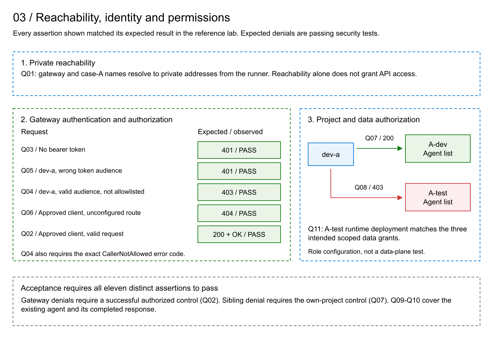

# Governance Lab Tests

## Purpose And Architecture

The lab verifies authenticated model access through a private API Management gateway and project-scoped access to Foundry agents. A central Foundry resource supplies the model. Case A and case B have separate Foundry resources and agent subnets; dev and test projects have dedicated Storage, Search and Cosmos DB dependencies. A-dev is the working inference project and uses a project connection to the gateway. A-test supplies the sibling-project authorization and runtime-grant fixtures. Case B supplies additional provisioned project boundaries, not another validated inference path. A private runner executes the assertions with synthetic managed identities.

Tests run inside the private network without any VPN from the operator's computer. Azure VM Run Command uses the VM Agent to start Q01-Q10 on the runner, which has no public IP and no inbound SSH access. The operator needs Azure management permissions, not direct network access to the private endpoints. The VM requires a healthy agent and outbound connectivity to Azure; application requests still obey the lab's network and authorization controls. Q11 runs separately on the operator's computer against the Azure management APIs.

The acceptance profile contains the eleven assertions below. All eleven matched their expected result in the reference lab. An expected access denial is a successful security test, not an application failure. A repeat run is successful only when every assertion passes; an unexpected response or a missing prerequisite must stop acceptance.



## Assertions And Results

### Q01: Private Name Resolution

**Purpose.** Verify that the runner resolves the gateway and case-A service through private addressing before interpreting application responses.

**Assertion.** Every address returned for both service names is private.

**Observed result.** Both names resolved exclusively to private addresses. **PASS: matches expectation.** This assertion concerns runner DNS resolution, not all possible runtime network paths.

### Q02: Authorized Gateway Inference

**Purpose.** Establish that the configured route, model backend and approved client work together. This is the positive control for the gateway denial tests.

**Assertion.** An approved client's cognitive-services token and a valid chat request produce HTTP 200, a completed assistant message and the exact text `OK`.

**Observed result.** HTTP 200 and the expected completed `OK` response. **PASS: matches expectation.**

### Q03: Authentication Required

**Purpose.** Verify that knowing the private gateway address does not grant model access.

**Assertion.** The same valid request without a bearer token produces HTTP 401 while Q02 passes.

**Observed result.** HTTP 401. **PASS: matches expectation.**

### Q04: Caller Allowlist Enforced

**Purpose.** Separate possession of a valid token from permission to use the gateway.

**Assertion.** The dev-a identity, which is outside the gateway caller allowlist, receives HTTP 403 with `CallerNotAllowed` when using a cognitive-services token; Q02 must pass.

**Observed result.** HTTP 403 with `CallerNotAllowed`. **PASS: matches expectation.**

### Q05: Token Audience Enforced

**Purpose.** Verify that a token issued for the Foundry project API cannot be substituted for the gateway's required audience.

**Assertion.** A token with audience `https://ai.azure.com` produces HTTP 401 on the gateway route; Q02 must pass.

**Observed result.** HTTP 401. **PASS: matches expectation.** Q04 separately demonstrates the caller-authorization boundary; this assertion concerns rejection of the wrong-audience request.

### Q06: Deployment Route Restricted

**Purpose.** Verify that an approved caller cannot select an arbitrary deployment through the gateway.

**Assertion.** A request for an unconfigured deployment route produces HTTP 404 with the same approved client used by Q02.

**Observed result.** HTTP 404. **PASS: matches expectation.**

### Q07: Developer Access To Own Project

**Purpose.** Establish the developer's authorized project access before testing project separation.

**Assertion.** dev-a lists A-dev agents and receives HTTP 200 with a valid agent-list response.

**Observed result.** HTTP 200 with the expected list schema. **PASS: matches expectation.**

### Q08: Sibling Project Access Denied

**Purpose.** Verify that a developer's A-dev permissions do not confer agent-list access to A-test.

**Assertion.** The same identity and token used by Q07 receive a typed authorization denial, HTTP 403, when listing A-test agents; Q07 must pass.

**Observed result.** The expected authorization denial on A-test. **PASS: matches expectation.** The assertion covers this project operation, not every possible project permission.

### Q09: Owned Agent Version Preserved

**Purpose.** Ensure that inference exercises the intended existing agent and does not silently create or replace it.

**Assertion.** Reading the agent returns HTTP 200, the expected ownership marker and definition, and latest version `1`. The repeat-test workflow performs no agent creation, update or deletion.

**Observed result.** The expected existing agent and version were verified. **PASS: matches expectation.**

### Q10: Agent Inference Completes

**Purpose.** Exercise the working agent through the Foundry Responses API, in addition to the direct gateway control in Q02.

**Assertion.** After Q09 passes, a request explicitly referencing agent version `1` returns HTTP 200 and a completed, validated assistant response. The request disables storage, streaming, background execution and truncation and sets a bounded output budget.

**Observed result.** The referenced agent completed inference successfully. **PASS: matches expectation.** Request settings are checked as request settings; they are not an independent audit of service retention.

### Q11: Runtime Grants Match Their Intended Scope

**Purpose.** Verify that A-test's runtime role deployment grants exactly the intended container and database access to its project managed identity.

**Assertion.** The deployment is Succeeded and returns exactly the three expected role assignments: Blob Data Contributor on the blobstore container, Blob Data Owner on the agent container and Cosmos DB Built-in Data Contributor on `enterprise_memory`. Each assignment's ID, principal, role definition and scope match its deployment record.

**Observed result.** All three assignments matched. **PASS: matches expectation.** This assertion verifies role configuration, not a data-plane read or write by A-test.

## Interpretation

The lab behaves as expected for this acceptance profile: authorized gateway and A-dev agent requests succeed; anonymous, disallowed-caller, wrong-audience, wrong-route and sibling-project requests are rejected as specified; the agent version and scoped role configuration match their intended values.

The gateway authorization example is illustrative. Q02 and Q04 exercise the policy's object-ID allowlist, not Entra app roles. Production deployments use the app-role pattern in [Governance](Governance.md#33-production-app-role-authorization), section 3.3, with tokens intended for the registered gateway API and the required `roles` claim. Acceptance must then verify authorized direct and agent requests and rejection of missing or incorrect roles and wrong audiences; the existing Q01-Q11 results do not establish those production controls.

This is a functional and access-control lab. Production availability, disaster recovery, load capacity, complete effective-permission analysis and independent end-to-end telemetry attribution are separate qualification activities. They are not assertions in this profile. Case dev/test projects share a case agent subnet; project authorization is not a claim of network isolation between those projects.

## Run The Assertions

Create the environment using [Lab Lifecycle](Lifecycle.md). From the package root, use the resulting private state file with the command below. This repeats the eleven assertions without creating, replacing or deleting the agent. It does not tear down the lab.

```powershell
$state = Read-Host 'Absolute path to the private lab state.json'
./scripts/Invoke-QuickLab.ps1 -StatePath $state -RunLive
```

Acceptance requires exactly Q01-Q11, each with PASS. The command fails acceptance for missing, duplicate or nonpassing assertions. Inspect the private report identified in its output to distinguish an unexpected response from an unavailable prerequisite; neither counts as a pass. Keep that report outside the shareable package.

The reference results support the stated expectations. The design aligns with Microsoft's private-network, managed-identity and centralized-gateway patterns described in the lifecycle document; these assertions do not certify every production best practice.
