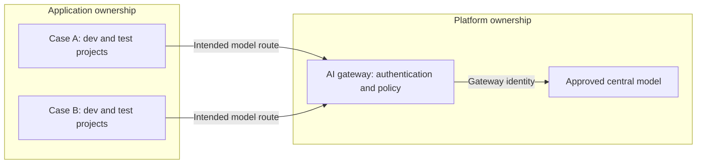
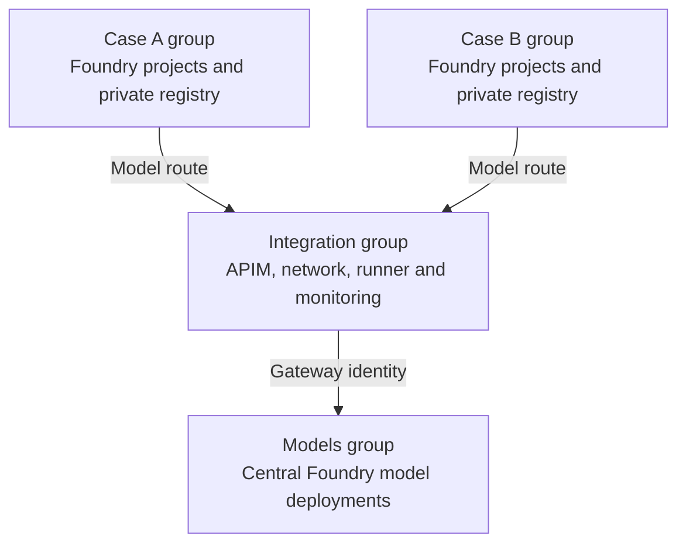
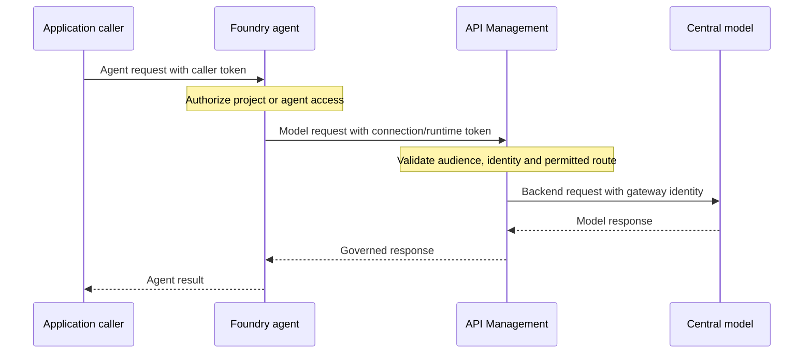

# Architecture: Principles And Boundaries

The lab addresses a common organizational problem: application teams need autonomy to build agents, while model access, identity, data permissions and network exposure must remain governed. These are separate boundaries. A single shared resource or a private endpoint cannot enforce all of them.

This document explains the design. It is not an inventory of a running environment. Start with the [governance principles and original diagrams](Governance.md) for the organizational model. The [independent lifecycle](independent-lifecycle.md) provisions the core; [Standard expansion](full-expansion-plan.md) adds agent-service dependencies. Historical results are discussed separately in the [evidence summary](lab-summary.md).

## Separate Model Ownership From Application Development

The platform owns approved model deployments and the gateway through which applications consume them. Application teams own agent definitions and their permitted data and tools within assigned projects. A model connection makes a backend discoverable; it does not copy the model or grant permission to invoke it.

The diagram expresses the intended route, not proof that every agent protocol can use it. Model discovery, connection scope, token audience and runtime compatibility must all agree. An API call working through APIM does not establish that a Foundry agent can resolve and use the same connection.

Central governance need not mean a single physical model account in production. Capacity, availability and processing-location requirements can require several approved backends. Resource region and inference processing geography are different: a Global deployment must not be described as region-confined processing.

The general strategy permits explicitly approved native routes where equivalent controls are demonstrated. The lab chooses a stricter baseline: APIM is the intended model route, with no native bypass exception or local model deployment in application accounts. It is an implementation of the principles, not the only possible organizational topology.

## Choose The Right Isolation Boundary

| Boundary | What it separates | What it does not establish |
| --- | --- | --- |
| Resource group | Ownership, deployment and lifecycle | Network isolation or absence of inherited permissions. |
| Foundry account | Resource administration, shared connections and account-level network configuration | Independent project permissions unless RBAC is scoped accordingly. |
| Project | Agent definitions, connections and project-level authorization | A separate network perimeter. |
| Subnet and NSG | Permitted traffic between network locations | Which user or workload may operate a service. |
| Identity and role assignment | Authorized actions on a destination | Network reachability or application-level user ownership. |

The core uses four resource groups: models, integration, case A and case B. Each case has a Foundry account, dev/test projects and a private registry. Integration contains APIM, the network, private DNS, the runner, synthetic identities and monitoring. The central account hosts models without application projects.

Development and test projects share their case's agent subnet. The two cases have separate agent subnets and explicit cross-case restrictions, but the lab does not demonstrate dev/test network isolation. Azure RBAC is additive: a narrow project role does not cancel a broader inherited grant.

## Distinguish Caller, Runtime And Backend Identities

Each arrow is a different authorization decision. The person invoking an agent, the identity used by its model connection and the gateway identity need not be the same. Hosted execution and image pulls add further identities; their permissions must be verified at the actual caller, not inferred from a project role.

The lab uses managed identities as synthetic actors. Developers receive own-project access; publishers and readers receive repository-scoped registry permissions. APIM receives the central-model inference grant. Applications do not receive that grant from the lab, but inherited access still needs assessment.

All synthetic identities attached to the runner are available to processes on that VM. This is a convenient authorization test fixture, not isolation between untrusted workloads and not a demonstration of human group membership or privileged-access management.

## Make The Gateway A Controlled Route

The gateway validates tokens and permitted callers, fixes the backend and model route, validates request structure, constrains generation and applies usage controls. It authenticates to the model with its own managed identity rather than forwarding a caller-supplied key.

These controls have distinct meanings. Schema validation is not prompt-content safety screening. Request rate, token consumption and monetary budget are different limits. A shared counter is not a per-application allowance. Metrics alone do not attribute an individual agent request to a gateway/backend call.

The core's explicit caller allowlist is a lab mechanism, not a complete production access-management system. Production requires managed application authorization, controlled policy changes, inherited-access review and evidence that alternate routes cannot bypass governance.

## Treat DNS, Routing And Authorization Separately

The default private network is unpeered. Private endpoints provide service ingress; delegated agent networking and APIM VNet integration provide runtime or gateway egress. Neither direction implies the other. NAT supplies outbound connectivity, not an egress allowlist or data-exfiltration control.

Private DNS maps service names to endpoint addresses. Correct resolution is necessary, but does not prove that traffic reaches the intended endpoint or that the caller is authorized. Checks must originate from the real source: runner success does not establish agent-runtime or hosted image-pull connectivity.

A shared-network VPN design is possible, but is not part of core provisioning. It needs non-overlapping address spaces, gateway transit, client routes, DNS resolution through linked zones and explicit NSG permissions for the VPN client pool. The lab's endpoint rules restrict incoming sources and the runner denies inbound connections by default. A peering alone does not provide DNS resolution or override these rules.

The public Azure portal and ARM APIs are separate from private service endpoints. An operator can inspect management metadata without being able to use a playground or invoke a private model. Run Command administers the private runner through the VM agent without requiring inbound SSH or copying operator credentials.

## Add Agent Dependencies Explicitly

The core provides the model, gateway, projects, registries and private infrastructure. It does not provision a complete Standard agent-service runtime.

Standard expansion adds dedicated Storage, Search and Cosmos DB dependencies per project, their connections, capability-host configuration and scoped access. This reduces cross-project service permissions. Provisioning permissions and runtime data permissions remain separate; configuring a dependency is not the same as reading or writing application data.

Cosmos DB Direct mode illustrates why useful implementation detail matters: HTTPS connectivity alone may not cover its additional TCP connections. The expanded workflow scopes the required rule to the verified endpoint addresses rather than opening an entire destination network.

Hosted agents additionally require a compatible image-pull path, runtime identity, supported networking and actual platform startup. A publisher's successful image push or a VM's successful pull proves neither platform image access nor agent execution.

## Verify Claims At The Right Level

| Evidence | Supports | Does not establish |
| --- | --- | --- |
| Offline template and script checks | Implementation constraints and regression detection | Azure runtime behavior. |
| ARM completion and configuration readback | Provisioned resources and observed settings | Working inference or complete governance. |
| Authorized request plus controlled denial | A specific authorization boundary | All identities, inherited grants or alternate routes. |
| Real agent response | That agent, version and tested connection path worked | Full caller attribution, retention or hosted execution. |
| Owned-resource absence | Removal of the observed resource set | Zero delayed charges, purge or a clean rebuild. |

The [test plan](test-plan.md) defines the checks. Tests, creation and removal require separate requests. Run state, credentials and raw evidence remain private; published reports explain outcomes and limitations without acting as live inventory or granting operational consent.

## Further Reading

- [Independent lifecycle](independent-lifecycle.md): deploy a new core and request tests or removal separately.
- [Expansion design](full-expansion-plan.md): Standard dependencies and hosted execution.
- [Evidence summary](lab-summary.md): what historical experiments demonstrate.
- [Foundry resource and project planning](https://learn.microsoft.com/azure/foundry/concepts/planning).
- [Foundry roles and scopes](https://learn.microsoft.com/azure/foundry/concepts/rbac-foundry).
- [Foundry private networking](https://learn.microsoft.com/azure/foundry/agents/how-to/virtual-networks).
