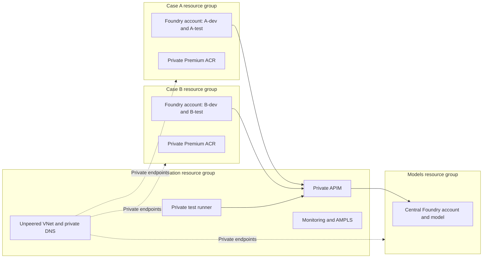
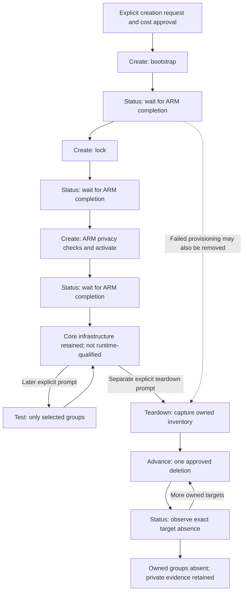

# Independent Lab Lifecycle

Use [Invoke-Lab.ps1](../scripts/Invoke-Lab.ps1) for a **new four-group core lab**. Creation provisions infrastructure only. A later explicit request selects test groups; a separate later request authorizes teardown. Resources remain deployed and billable between these requests. Successful tests are not a prerequisite for removal.

## Scope And Architecture

The core profile is the complete default [main.bicep](../infra/main.bicep) topology: four new resource groups, three Foundry accounts, four projects, central model, APIM Standard v2, private networking and runner, managed identities, monitoring and two Premium registries. Public APIM access is temporarily enabled during bootstrap and disabled by lock. Activation installs the API, policy, model authorization and connections.



This is **not the expanded Standard agent-service profile**. It does not provision per-project Storage/Search/Cosmos dependencies or capability hosts, deploy hosted workloads, or create an observation agent. Those remain separate, advanced workflows. Do not claim end-to-end agent inference or Q01-Q11 acceptance from core provisioning. Existing minimal/expanded runs retain their own coordinators and evidence; do not rewrite their state to use this entry point.

## Lifecycle Contract



Creation uses compilation, ARM validation/what-if, ownership checks and fresh management-plane postconditions. These are deployment safety checks, not lab tests. It never invokes a test harness, prepares the runner, sends inference or grants future deletion consent. The private-network test flag remains false until an explicitly requested test passes.

One `Create` submits at most one stage. Pending work is observed, never replayed. `Status` does not deploy. A process exit or submission acknowledgement is not completion. Failed/uncertain operations require diagnosis from preserved evidence; never clear pending markers or blindly retry. This revision has offline safety coverage, not a live qualification of a new deployment.

## Preparation

Use PowerShell 7 on Windows, Azure CLI with its bundled Python, Bicep and OpenSSH. Confirm the intended subscription and tenant, deployment/RBAC permissions, registered providers, organizational policies, Sweden Central capacity and recurring costs before creation. Do not change inherited policy or register providers implicitly. Pinned Bicep modules require network access or a previously approved local cache.

Use a dedicated authenticated Azure CLI directory and a private run directory, both outside this repository. Confirm a fresh ARM token through the normal sign-in flow without printing it; account metadata alone does not prove token validity. Never enter credentials in chat. The initializer checks token expiration and binds the selected subscription, tenant, ownership and baseline inventory into private state.

Set these variables once after reviewing the paths. The generated identifier and run directory must be unused:

```powershell
$azureConfig = Read-Host 'Absolute path to the dedicated authenticated Azure CLI directory'
$labId = 'lab' + [guid]::NewGuid().ToString('N').Substring(0, 8)
$state = Join-Path $env:LOCALAPPDATA "FoundryLab/$labId/state.json"
$compiler = (Get-Command bicep -CommandType Application).Source
```

## Create And Observe

After explicit approval for this core scope and its costs:

```powershell
./scripts/Invoke-Lab.ps1 -Action Create -StatePath $state -LabId $labId -AzureConfigDirectory $azureConfig -BicepExecutable $compiler -ApproveDeployment
./scripts/Invoke-Lab.ps1 -Action Status -StatePath $state
```

Execute commands separately. While pending, use only `Status`, within an agreed observation budget. After each phase completes, repeat `Create` with the same state and `-ApproveDeployment` to advance. It generates and checks a scoped what-if before submitting. This switch represents the already approved creation request, not a separate teardown grant.

After activation completes, repeat `Create` once to check the final core infrastructure. It must report `Infrastructure provisioned (full core profile)` without a new submission. Leave resources active. Do not run tests as a hidden completion gate. A missing group, stale preview, active deployment or ownership mismatch stops progress instead of repairing the environment implicitly. Keep source unchanged during a run because previews bind file hashes.

For human-reviewed per-stage previews, the underlying [Invoke-LabStage.ps1](../scripts/Invoke-LabStage.ps1) exposes `Preview`, `Deploy` and `Status`; use it only after initialization and do not run it concurrently with the coordinator. The coordinator's file lock is local to its state path, not a distributed Azure lock.

## Later Targeted Tests

There is no default test suite and no `All` group. Ask for exact groups in a subsequent prompt. Live tests can incur inference charges and create temporary fixtures. Remote groups prepare the runner and upload their harnesses only when requested.

| Group | Scope and side effects |
| --- | --- |
| PrivateNetwork | Runner DNS, TCP/HTTPS and endpoint bindings; records connectivity evidence. |
| ControlPlane | Management configuration assertions; no runtime qualification. |
| Gateway | Gateway authentication, payload and inference checks; model charges possible. |
| Identity | Authorization and direct-access checks; live requests. |
| Agent | Disposable-agent lifecycle and authorization; creates/deletes test fixtures, may report blocked inference. |
| Registry | Image push/pull and registry authorization; writes synthetic image fixtures. |
| PublicAccess | External endpoint-denial checks. |
| AfterTeardown | Post-removal inventory/activity checks; requires destroyed state. |
| RetainedRecords | Read-only retained-service records; requires destroyed state, never purges. |

Gateway, Identity, Agent and Registry require a previously passing `PrivateNetwork` group, or that group explicitly included in the same request. It runs first when selected; the coordinator never adds it without consent. A failed rerun invalidates earlier connectivity evidence.

```powershell
./scripts/Invoke-Lab.ps1 -Action Test -StatePath $state -TestGroup PrivateNetwork,Gateway -ApproveTests
./scripts/Invoke-Lab.ps1 -Action Test -StatePath $state -TestGroup ControlPlane -ApproveTests
```

Each line is an independent example, not a mandatory sequence. Inspect the private report verdicts: `BLOCKED` and `INCONCLUSIVE` are not `PASS`, and command completion is not acceptance. No test removes the lab, stops the runner or grants teardown consent. The retained expanded profile's Q01-Q11 workflow is different and must not be substituted for these groups.

## Separately Approved Teardown

First inspect/capture the exact owned inventory. This is not deletion approval:

```powershell
./scripts/Invoke-Lab.ps1 -Action Teardown -StatePath $state -TeardownStep Evidence
```

Only after the user explicitly requests removal of this lab, read its exact identifier from the reviewed state, bind `$labId`, and authorize one step:

```powershell
./scripts/Invoke-Lab.ps1 -Action Teardown -StatePath $state -TeardownStep Advance -ConfirmLabId $labId -ApproveTeardown
./scripts/Invoke-Lab.ps1 -Action Teardown -StatePath $state -TeardownStep Status
```

Repeat the approved Advance/Status cycle until exact owned-group absence is established. Each Advance submits at most one deletion: monitoring links, Foundry projects, accounts, then resource groups, with integration last. It records the pending target before submission and refuses automatic resubmission while the target exists. An uncertain submission requires diagnosis, not clearing its marker. Fresh approval and the matching identifier are required on every destructive invocation; the state does not store future deletion permission.

Teardown can follow a failed deployment and does not require test success. It still requires terminal deployments, exact ownership, unchanged inventory evidence and safe dependencies. Empty owned groups from partial provisioning can be removed; preexisting resources cannot be adopted. Keep private state and evidence after removal. Purge, provider unregistration, unrelated-resource cleanup and reuse of a destroyed run are out of scope. A new lab requires a new identifier and private run directory.

## Copilot Requests

Creation: "Create the four-group core infrastructure in the confirmed subscription. Do not execute tests or teardown. Leave resources active."

Later tests: "For this existing state, run only PrivateNetwork and Gateway. Do not deploy infrastructure or remove the lab."

Later teardown: "Remove only the lab identified by this state and lab ID. Review its captured inventory and proceed with guarded teardown. Preserve private evidence."

Report the selected scope, current phase, pending operation, elapsed time and private evidence location. Do not publish private identifiers, tokens or run outputs. Historical results are not results for the current subscription.